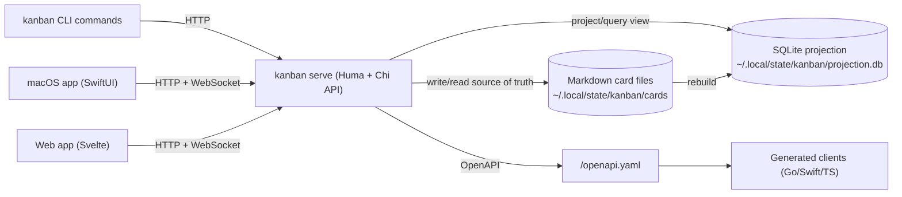

# Kanban Monorepo

A multi-project Kanban system where Markdown files are the source of truth and SQLite is a query projection.

This repository contains:
- A Go `kanban` binary (server + CLI commands in one executable)
- A native macOS app (`apps/kanban-macos`)
- A Svelte + TypeScript web app (`apps/kanban-web`)

## Why this exists

- Manage many projects from one Kanban backend.
- Keep data human-readable in Markdown.
- Keep queries fast in SQLite.
- Keep clients in sync using websocket events.

## High-level architecture



## Monorepo layout

- `backend`: Go module with API server, CLI command tree, service, store, and generated Go client.
- `apps/kanban-macos`: SwiftUI macOS app + tests/e2e harness.
- `apps/kanban-web`: Svelte TypeScript frontend + Playwright e2e.
- `todo.md`: project background, decisions, plan, and execution checklist.
- `AGENTS.md`: development rules (strict TDD, workflow, git constraints).

## Data model and runtime model

- Card statuses: `Todo`, `Doing`, `Review`, `Done`.
- Card IDs: `<project-slug>/card-<number>`.
- Markdown is authoritative.
- SQLite is rebuildable projection (`POST /admin/rebuild`).
- Websocket events notify clients (`/ws`), including `resync.required` when event backlog is saturated.

## Configuration

Shared config file:
- `~/.config/kanban/config.yaml`

Shape:
- Top-level: `server_url`
- `backend`: `sqlite_path`, `cards_path`
- `cli`: `output`

Precedence (high to low):
1. CLI/server flags
2. Environment variables
3. `~/.config/kanban/config.yaml`

## Quick start

Start backend server:

```bash
make run-backend
```

Useful overrides:

```bash
KANBAN_ADDR=127.0.0.1:9090 \
KANBAN_CARDS_PATH=$HOME/.local/state/kanban/cards \
KANBAN_SQLITE_PATH=$HOME/.local/state/kanban/projection.db \
make run-backend
```

Run CLI examples:

```bash
cd backend
kanban project create --name "API Backend"
kanban card create -p api-backend -t "Implement health endpoint" -s Todo
kanban card move -p api-backend -i 1 -s Doing
kanban watch -p api-backend
```

Run macOS app:

```bash
make run-swift-app
```

Run web app (standalone dev mode):

```bash
make frontend-install
make frontend-dev
```

## Testing

```bash
make test
make test-swift-e2e
make frontend-test-e2e
```

Backend-only tests:

```bash
make test-backend
```

## OpenAPI and code generation

Backend serves OpenAPI at `/openapi.yaml`.
Generated clients are used by CLI and UI apps to stay in sync with API contract changes.
