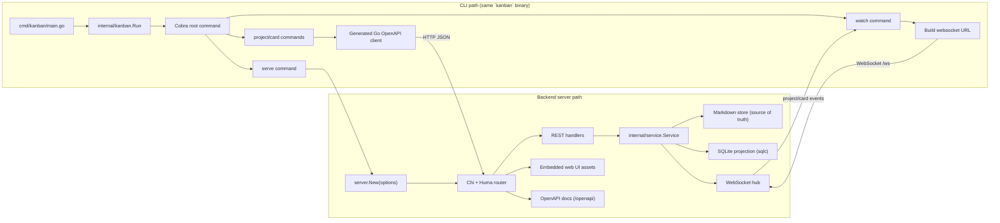
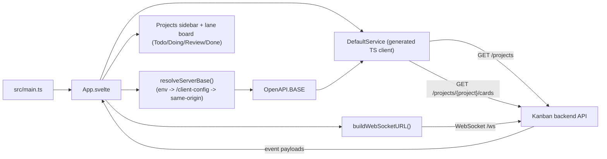
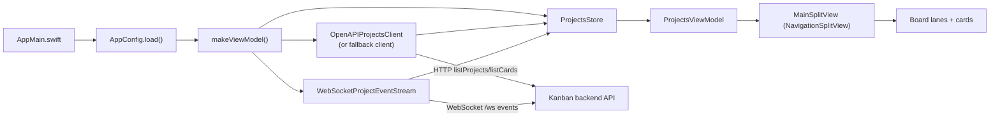

# Architecture Diagrams

## Backend + CLI (`backend`)

```mermaid
flowchart LR
  subgraph CLI["CLI path (same `kanban` binary)"]
    MAIN["cmd/kanban/main.go"] --> RUN["internal/kanban.Run"]
    RUN --> ROOT["Cobra root command"]
    ROOT --> PROJ["project/card commands"]
    ROOT --> WATCH["watch command"]
    ROOT --> SERVE_CMD["serve command"]

    PROJ --> GOCLIENT["Generated Go OpenAPI client"]
    WATCH --> WSURL["Build websocket URL"]
  end

  subgraph SERVER["Backend server path"]
    SERVE_CMD --> NEW["server.New(options)"]
    NEW --> ROUTER["Chi + Huma router"]
    ROUTER --> HANDLERS["REST handlers"]
    HANDLERS --> SERVICE["internal/service.Service"]
    SERVICE --> MD["Markdown store (source of truth)"]
    SERVICE --> SQLITE["SQLite projection (sqlc)"]
    SERVICE --> HUB["WebSocket hub"]
    ROUTER --> WEBUI["Embedded web UI assets"]
    ROUTER --> OAPI["OpenAPI docs (/openapi)"]
  end

  GOCLIENT -->|"HTTP JSON"| ROUTER
  WSURL -->|"WebSocket /ws"| HUB
  HUB -->|"project/card events"| WATCH
```

## Frontend (`apps/kanban-web`)

```mermaid
flowchart LR
  MAIN["src/main.ts"] --> APP["App.svelte"]

  APP --> BASE["resolveServerBase()\n(env -> /client-config -> same-origin)"]
  BASE --> OPENAPI["OpenAPI.BASE"]

  APP --> API["DefaultService (generated TS client)"]
  OPENAPI --> API
  API -->|"GET /projects"| BACKEND["Kanban backend API"]
  API -->|"GET /projects/{project}/cards"| BACKEND

  APP --> WSBUILD["buildWebSocketURL()"]
  WSBUILD -->|"WebSocket /ws"| BACKEND
  BACKEND -->|"event payloads"| APP

  APP --> UI["Projects sidebar + lane board (Todo/Doing/Review/Done)"]
```

## macOS App (`apps/kanban-macos`)

```mermaid
flowchart LR
  APPMAIN["AppMain.swift"] --> CFG["AppConfig.load()"]
  CFG --> VMFACTORY["makeViewModel()"]

  VMFACTORY --> APICLIENT["OpenAPIProjectsClient\n(or fallback client)"]
  VMFACTORY --> STREAM["WebSocketProjectEventStream"]
  VMFACTORY --> STORE["ProjectsStore"]

  APICLIENT --> STORE
  STREAM --> STORE

  STORE --> VM["ProjectsViewModel"]
  VM --> VIEW["MainSplitView (NavigationSplitView)"]
  VIEW --> BOARD["Board lanes + cards"]

  APICLIENT -->|"HTTP listProjects/listCards"| BACKEND["Kanban backend API"]
  STREAM -->|"WebSocket /ws events"| BACKEND
```
